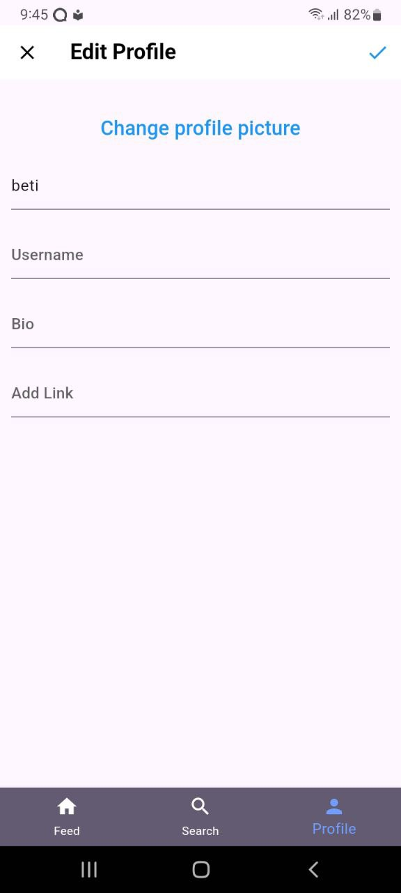

---

# Hibir App

Hibir is a mobile application developed using Flutter for the frontend, Laravel as the backend, and MySQL as the database. The app is designed to provide a platform where users can share cultural posts and engage through comments and likes, fostering community interaction.

## Features

- **User Authentication**: Secure login and registration system using JWT authentication.
- **Post Management**: Users can create, edit, and delete posts, supporting both image and video attachments.
- **Comments and Likes**: Users can comment on and like posts to interact with each other.
- **Real-Time Notifications**: Instant notifications for comments and likes on user posts.
- **Admin Dashboard**: An admin interface for managing users and content.
- **Responsive UI**: Flutter-based mobile app for a seamless experience across Android and iOS devices.
- **RESTful API**: The backend is powered by Laravel, providing APIs for the mobile app.

## Tech Stack

### Frontend
- **Flutter**: Cross-platform mobile app framework.
  
### Backend
- **Laravel**: PHP framework for backend logic and API development.
- **MySQL**: Relational database to store user and application data.

### Additional Tools
- **Shared Preferences**: Used to store authentication tokens locally on the client side.
- **HTTP**: For making requests from the Flutter frontend to the Laravel backend.

## Screenshots

### Admin Dashboard


### User Interface

<p align="center">
  
  
</p>

## Documentation
For a detailed overview of the project, including the design process and technical specifications, you can refer to the [Hibir App Documentation](frontend/assets/Hibir.pptx).

## Installation

### Prerequisites
- [Flutter SDK](https://flutter.dev/docs/get-started/install) for the frontend.
- [XAMPP](https://www.apachefriends.org/index.html) or MySQL for database management.
- [Composer](https://getcomposer.org/download/) to install Laravel dependencies.
- A local server environment like XAMPP or Laravel's built-in server.

### Steps

1. **Clone the repository:**
   ```bash
   git clone https://github.com/takee114/Hibir.git
   ```

2. **Backend Setup (Laravel):**
   - Navigate to the `backend` folder:
     ```bash
     cd backend
     ```
   - Install Laravel dependencies:
     ```bash
     composer install
     ```
   - Configure the `.env` file with your database settings:
     ```env
     DB_CONNECTION=mysql
     DB_HOST=127.0.0.1
     DB_PORT=3306
     DB_DATABASE=your_database_name
     DB_USERNAME=your_username
     DB_PASSWORD=your_password
     ```
   - Run database migrations:
     ```bash
     php artisan migrate
     ```
   - Start the Laravel development server:
     ```bash
     php artisan serve
     ```

3. **Frontend Setup (Flutter):**
   - Navigate to the `frontend` folder:
     ```bash
     cd frontend
     ```
   - Install Flutter dependencies:
     ```bash
     flutter pub get
     ```
   - Run the Flutter app:
     ```bash
     flutter run
     ```

## API Endpoints

| Method | Endpoint          | Description                     |
|--------|-------------------|---------------------------------|
| POST   | `/api/login`       | Log in a user                   |
| POST   | `/api/register`    | Register a new user             |
| GET    | `/api/posts`       | Fetch all posts                 |
| POST   | `/api/posts`       | Create a new post               |
| PUT    | `/api/posts/:id`   | Update a post by ID             |
| DELETE | `/api/posts/:id`   | Delete a post by ID             |

## Contribution

Feel free to contribute by submitting issues or pull requests. For significant changes, kindly open an issue first to discuss the proposed updates.

## License

This project is licensed under the [MIT License](LICENSE).

---
